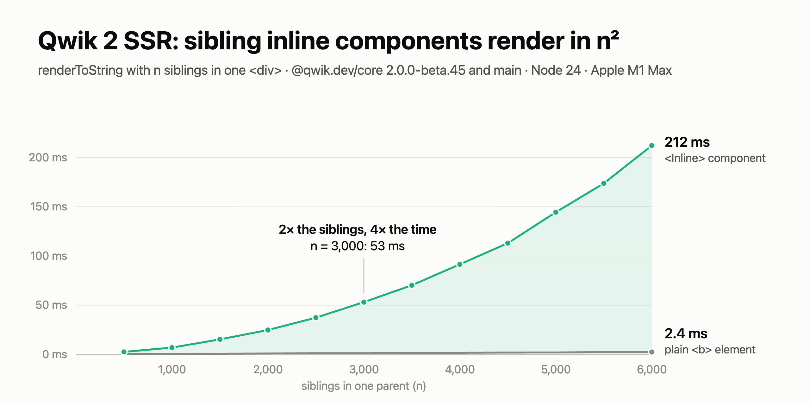
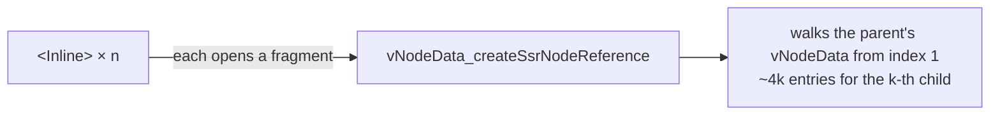

# Qwik 2 SSR: n² render time for sibling inline components

An inline component is a plain function component: no `component$`, no `<Slot/>`. When a parent has many of them as children, `renderToString` gets slower with n². Double the children, and the render takes 4× as long. The same markup as plain elements takes 2× as long, as expected.



```tsx
const Inline = ({ children }) => <b>{children}</b>;

await renderToString(
  <div>{Array.from({ length: 1000 }, (_, i) => <Inline>{i}</Inline>)}</div>,
  { containerTagName: "div" },
);
```

- **Cause:** each inline component opens a fragment, and Qwik computes the fragment's position by walking the parent's whole `vNodeData` array from the start. That array grows with every child.
- **Fix:** remember where the last walk stopped and continue from there. The render becomes linear, and the HTML stays byte-identical.
- **Affected:** `@qwik.dev/core` 2.0.0-beta.45 and the nightly from `main`.
- **Issue:** [QwikDev/qwik#9084](https://github.com/QwikDev/qwik/issues/9084)

## Run it

```sh
npm install
npm run bench          # @qwik.dev/core 2.0.0-beta.45 as published
npm run bench:patched  # same, with the change below applied to dist/server.prod.mjs
```

`npm run bench` does a client build first, as Qwik needs `q-manifest.json`. It then does an SSR build and times `renderToString` (median of 5, after a warm-up).

## Results

Node 24.13, Apple M1 Max, production build:

| n | `<Inline>` | `<b>` | `<Inline>` + patch |
|---:|---:|---:|---:|
| 500 | 2.0 ms | 0.2 ms | 0.6 ms |
| 1,000 | 6.6 ms | 0.5 ms | 0.9 ms |
| 2,000 | 24.3 ms | 1.1 ms | 1.7 ms |
| 4,000 | 94.1 ms | 2.3 ms | 5.2 ms |

With the patch, the HTML is byte-identical: the bench prints a sha1 of the HTML without the random `q:instance` and without the two build hashes (`q:manifest-hash` and the `bundle-graph.json` name). Those change because the client build also bundles the patched server file.

The Qwik nightly from `main` (`026ae0e`) gives the same numbers as beta.45.

## Cause

An inline component renders as a fragment. [`openFragment`](https://github.com/QwikDev/qwik/blob/5abe616/packages/qwik/src/server/ssr-container.ts#L819-L824) calls `getOrCreateLastNode()` for every fragment, which calls [`vNodeData_createSsrNodeReference`](https://github.com/QwikDev/qwik/blob/5abe616/packages/qwik/src/server/vnode-data.ts#L83-L116).

That function computes the new node's path by walking the parent element's `vNodeData` array from index 1. The array grows by about 4 entries per child, so the k-th sibling walks about 4k entries. Counting confirms it: for n = 100, the function runs 206 times and walks 20,718 entries in total, and the parent's array ends at 402 entries. A CPU profile of the repro at n = 4,000 puts 89% of the time in `openFragment` and `vNodeData_createSsrNodeReference`.



## Fix

`vNodeData` only grows at the end, and only its last entry changes in place: `vNodeData_incrementElementCount` grows a trailing element count. So the scan can remember where it stopped for each array and resume there, rescanning just the last entry:

```ts
const scanCursors = new WeakMap<VNodeData, { index: number; stack: number[]; attributesIndex: number }>();

// in vNodeData_createSsrNodeReference
// short arrays are cheaper to rescan than to track
const track = vNodeData.length >= 16;
const saved = track ? scanCursors.get(vNodeData) : undefined;
const stack = saved ? saved.stack.slice() : [-1];
let attributesIndex = saved ? saved.attributesIndex : -1;
let cursorSaved = false;
for (let i = saved ? saved.index : 1; i < vNodeData.length; i++) {
  if (track && i === vNodeData.length - 1) {
    // entries before the last one never change, the last one may be an element count that grows in place
    scanCursors.set(vNodeData, { index: i, stack: stack.slice(), attributesIndex });
    cursorSaved = true;
  }
  // ... the existing loop body
}
if (track && !cursorSaved) {
  scanCursors.set(vNodeData, { index: vNodeData.length, stack: stack.slice(), attributesIndex });
}
```

The length check matters. Without it, a page of plain elements rendered about 25% slower in the css-in-js bench, because every element's own short `vNodeData` got a WeakMap entry.

A field on the element frame next to `vNodeData` would work as well as the WeakMap.

[`scripts/patch.mjs`](scripts/patch.mjs) applies the same change to the published `dist/server.prod.mjs` for `bench:patched`, then restores the original file.
